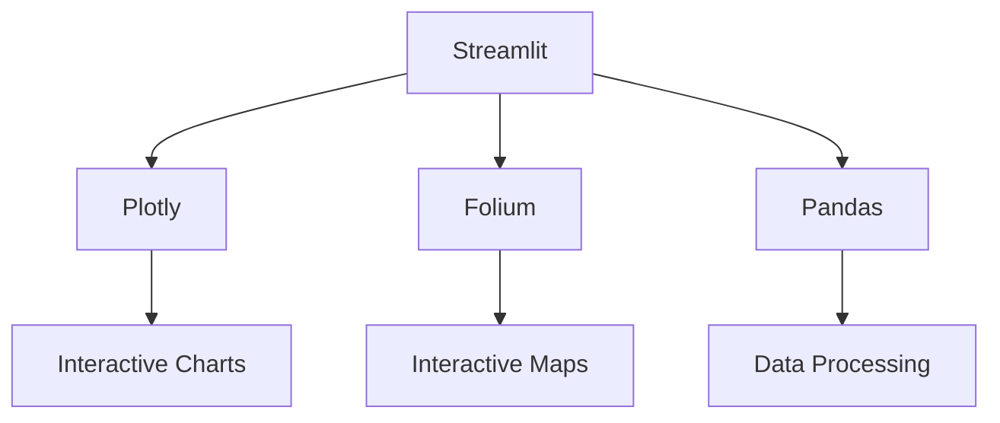

# Terra-app
# 🏝️ Terra Caribbean Property Intelligence Dashboard

  
*Example: Interactive dashboard with market analytics*

## 📌 Overview
A **Streamlit-powered** business intelligence tool for Terra Caribbean real estate professionals, providing:

- **Automated market analytics** for Caribbean property markets
- **AI-enhanced insights** with natural language processing
- **Interactive visualizations** of pricing trends and inventory
- **Geospatial intelligence** with amenity mapping

## ✨ Key Features

### 📈 Market Analytics
| Feature | Description |
|---------|-------------|
| Price Distribution | Histograms with avg/median markers |
| Parish Heatmaps | Geographic concentration analysis |
| Inventory Breakdown | By type, bedrooms, transaction status |

### 🤖 AI Integration
```python
# Example AI prompt
generate_ai_insights(filtered_df, market_name="Barbados")
```
- Natural language property search ("Beachfront villas under $1M")
- Automated market summary generation
- Data quality scoring (0-100 scale)

### 🌐 Geospatial Tools
- Folium maps with clustering
- Amenity layers (schools, beaches, restaurants)
- School zone radius visualization
- Transaction status color-coding

## 🛠️ Technical Implementation

### Tech Stack


### Data Flow
1. Excel data loading → 2. Geocoding → 3. Quality scoring → 4. Visualization

### API Integration
| Service | Usage |
|---------|-------|
| OpenAI | Market insights generation |
| OpenWeatherMap | Local weather widget |
| Mapbox | (Planned) Enhanced basemaps |

## 🚀 Getting Started

### Installation
```bash
# Clone repository
git clone https://github.com/yourrepo/terra-analytics.git
cd terra-analytics

# Create virtual environment
python -m venv venv
source venv/bin/activate  # Linux/Mac
venv\Scripts\activate    # Windows

# Install dependencies
pip install -r requirements.txt
```

### Configuration
1. Create `secrets.toml` in `.streamlit/` folder:
```toml
OPENAI_API_KEY = "sk-your-key-here"
OPENWEATHERMAP_API_KEY = "your-weather-key"
```

2. Place market data Excel files in `/data`

### Execution
```bash
streamlit run app.py
```

## 📸 Feature Highlights

| Section | Description |
|---------|-------------|
|  | Key metrics dashboard |
|  | Interactive price charts |
|  | Property location mapping |

## 🙏 Credits & Acknowledgments
- **Core Development**: Matthew Blackman
- **AI Systems**:
  - [DeepSeek Chat](https://chat.deepseek.com) - Primary architecture assistance
  - Google Gemini - Secondary code optimization
- **Data Providers**: Terra Caribbean website https://www.terracaribbean.com/Barbados/

## 📜 License
Proprietary software © 2025 Terra Caribbean.  
*For internal business use only.*

---

💡 **Tip**: For optimal performance with >10,000 listings, enable `@st.cache_data` decorators in the code.
```
